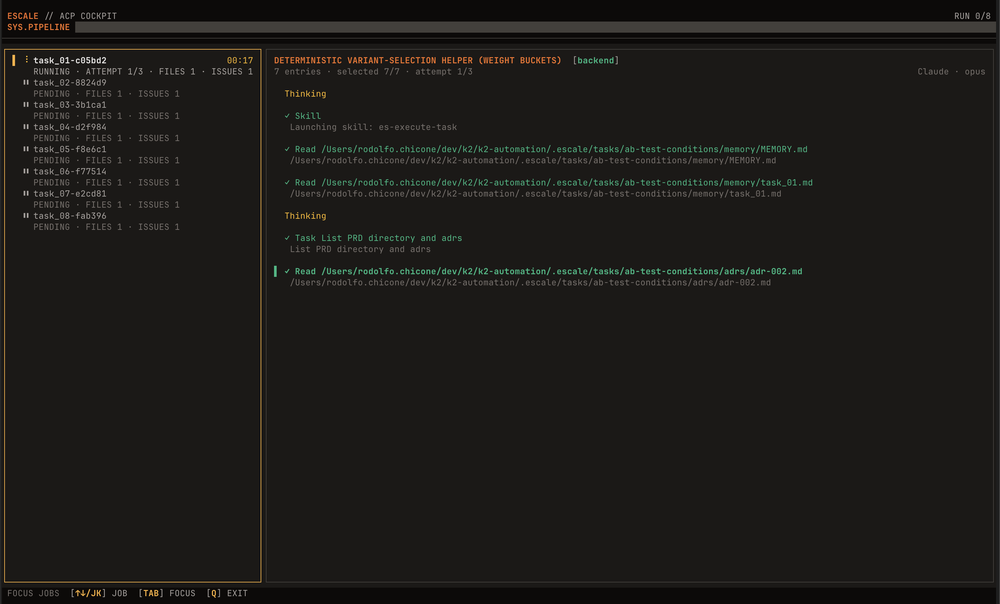
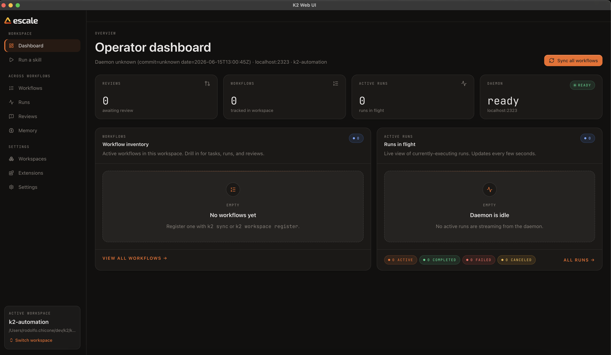

<div align="center">
  <h1>rc</h1>
  <p><strong>Orchestrate AI coding agents from idea to shipped code — in a single pipeline.</strong></p>
  <p>
    <a href="https://github.com/rodolfochicone/rc-project/actions/workflows/ci.yml">
      
    </a>
    <a href="https://pkg.go.dev/github.com/rodolfochicone/rc-project">
      
    </a>
    <a href="https://goreportcard.com/report/github.com/rodolfochicone/rc-project">
      
    </a>
    <a href="LICENSE">
      
    </a>
    <a href="https://github.com/rodolfochicone/rc-project/releases">
      
    </a>
  </p>
</div>

One CLI to replace scattered prompts, manual task tracking, and copy-paste review cycles. rc drives the full lifecycle of AI-assisted development: product ideation, technical specification, task breakdown with codebase-informed enrichment, concurrent execution across agents, and automated PR review remediation.

<div align="center">
  
</div>

## ✨ Highlights

- **One command, 40+ agents.** Install core workflow skills into Claude Code, Codex, Cursor, Droid, OpenCode, Pi, Gemini, and 40+ other agents and editors with `rc setup`, plus any setup assets shipped by enabled extensions.
- **Scaffold new projects.** `rc init` creates a private repository in the rodolfochicone organization from the TypeScript template and clones it locally; the `rc-new-project` skill does the same agentically.
- **Idea to code in a structured pipeline.** Optional Idea → PRD → TechSpec → Tasks → Execution → Review. Each phase produces plain markdown artifacts that feed into the next. Start from an idea for full research and debate, or jump straight to PRD if you already have a clear scope.
- **Codebase-aware enrichment.** Tasks aren't generic prompts. rc spawns parallel agents to explore your codebase, discover patterns, and ground every task in real project context.
- **Multi-agent execution.** Run tasks through ACP-capable runtimes like Claude Code, Codex, Cursor, Droid, OpenCode, Pi, or Gemini — just change `--ide`. Concurrent batch processing with configurable timeouts, retries, and exponential backoff, all with a live terminal UI.
- **Reusable agents.** Package a prompt, runtime defaults, and optional agent-local MCP servers under `.rc/agents/<name>/`, then run it from `rc exec --agent <name>` or through nested `run_agent` calls.
- **Workflow memory between runs.** Agents inherit context from every previous task — decisions, learnings, errors, and handoffs. Two-tier markdown memory with automatic compaction keeps context fresh without manual bookkeeping.
- **Provider-agnostic reviews.** Fetch review comments from CodeRabbit, GitHub, or run AI-powered reviews internally. All normalize to the same format. Provider threads resolve automatically after fixes.
- **Markdown everywhere.** PRDs, specs, tasks, reviews, and ADRs are human-readable markdown files. Version-controlled, diffable, editable between steps. No vendor lock-in.
- **Frontmatter for machine-readable metadata.** Tasks and review issues keep parseable metadata in standard YAML frontmatter instead of custom XML tags.
- **Executable extensions.** Intercept and modify any pipeline phase with subprocess hooks. Ship custom prompt decorators, lifecycle observers, review providers, and skill packs using the TypeScript or Go SDKs.
- **Single binary, local-first.** Compiles to one Go binary with zero runtime dependencies. Your code and data stay on your machine.
- **Embeddable.** Use as a standalone CLI or import as a Go package into your own tools.

## 📦 Installation

#### Homebrew

```bash
brew tap rodolfochicone/rc
brew install --cask rc
```

#### NPM

```bash
npm install -g @rodolfochicone/cli
```

#### Go

```bash
go install github.com/rodolfochicone/rc-project/cmd/rc@latest
```

#### From Source

```bash
git clone git@github.com:rodolfochicone/rc-project.git
cd rc-project && make verify && go build ./cmd/rc
```

#### Direct binary

Download the archive for your platform from the [GitHub Releases](https://github.com/rodolfochicone/rc-project/releases), verify its checksum, and drop the `rc` binary onto your `PATH`. This is the install method that supports in-place self-update via `rc update` (see below).

```bash
VERSION=0.1.0                                        # pick a release tag (without the leading "v")
OS=$(uname -s | tr '[:upper:]' '[:lower:]')          # darwin | linux
ARCH=$(uname -m); [ "$ARCH" = "x86_64" ] || ARCH=arm64   # x86_64 | arm64
BASE="https://github.com/rodolfochicone/rc-project/releases/download/v${VERSION}"
ASSET="rc_${VERSION}_${OS}_${ARCH}.tar.gz"

# Download the archive and the checksums file
curl -fsSL -o "$ASSET" "$BASE/$ASSET"
curl -fsSL -o checksums.txt "$BASE/checksums.txt"

# Verify the SHA-256 checksum
shasum -a 256 -c checksums.txt --ignore-missing

# Extract and install onto your PATH (avoid package-manager dirs like Homebrew/npm)
tar -xzf "$ASSET" rc
install -m 0755 rc "$HOME/.local/bin/rc"             # ensure ~/.local/bin is on your PATH

rc --version
```

> **Note:** while `rodolfochicone/rc-project` is a private repository, the release assets require authentication. Use the [`gh` CLI](https://cli.github.com/) instead of `curl` to download them:
>
> ```bash
> gh release download "v${VERSION}" --repo rodolfochicone/rc-project \
>   --pattern "rc_${VERSION}_${OS}_${ARCH}.tar.gz" --pattern checksums.txt
> ```

#### Keeping rc up to date

Update rc to the latest release with a single command:

```bash
rc update     # alias of: rc upgrade
```

`rc update` detects how the binary was installed and does the right thing:

| Install method | What `rc update` does                                                          |
| -------------- | ------------------------------------------------------------------------------ |
| Direct binary  | Downloads the latest release and self-updates **in place** (checksum-verified) |
| Homebrew       | Prints `brew upgrade --cask rc`                                                |
| NPM            | Prints `npm install -g @rc/cli@latest`                                         |
| Go install     | Prints `go install github.com/rodolfochicone/rc-project/cmd/rc@latest`         |

If you are already on the newest version, it prints `rc is already up to date`.

##### Configuring a token for updates (private repo)

While `rodolfochicone/rc-project` is private, the in-place self-update has to authenticate against the GitHub API to find releases. rc reads the token from the `GITHUB_TOKEN` environment variable (falling back to `GH_TOKEN`). Without it, `rc update` cannot see the private releases.

You have two ways to provide the token.

**Option A — reuse your `gh` CLI login (recommended).** If you already use the [`gh` CLI](https://cli.github.com/), it holds a valid token. Export it for a single run:

```bash
GITHUB_TOKEN="$(gh auth token)" rc update
```

Or make it persistent so plain `rc update` always works — add this to your shell profile (`~/.zshrc`, `~/.bashrc`, …):

```bash
export GITHUB_TOKEN="$(gh auth token)"
```

Then reload the shell (`source ~/.zshrc`) and run `rc update` normally.

**Option B — create a Personal Access Token (PAT).** If you don't use `gh`:

1. Go to **GitHub → Settings → Developer settings → Personal access tokens**.
   - **Fine-grained token:** grant access to the `rodolfochicone/rc-project` repository with **Contents: Read-only**.
   - **Classic token:** select the `repo` scope.
2. Copy the generated token (starts with `github_pat_` or `ghp_`).
3. Export it in your shell profile:

```bash
export GITHUB_TOKEN="github_pat_xxxxxxxxxxxxxxxxxxxx"
```

4. Reload your shell and run `rc update`.

> **Tip:** verify the token is set with `echo "${GITHUB_TOKEN:+token is set}"`. Keep the token secret — never commit it to a repository.

rc also shows an automatic `Update available` notice after a command when a newer release exists (cached for 24h). While the repository is private, this notice relies on the same token and is **silently skipped when no token is set**, so it never slows down or errors on regular commands. Set `RC_NO_UPDATE_NOTIFIER=1` to disable the notice entirely.

Then install core skills into your AI agents:

```bash
rc setup          # interactive — pick agents and skills
rc setup --all    # install everything to every detected agent
```

`rc setup` installs rc's core workflow skills plus any setup assets shipped by enabled extensions.

To add a single skill to a project that is already set up — without rerunning the full flow — use `rc add skill`:

```bash
rc add skill rc-git --agent claude --yes   # install one skill into a specific agent
```

The skill name must match a bundled or enabled-extension skill (e.g. `rc-git`); `--agent` is repeatable, and omitting it opens an interactive agent picker.

To install an individual rc resource — without running the full setup flow — use `rc install`:

```bash
rc install                 # list the installable resources
rc install --rtk           # detect rtk and, if missing, install it (confirms first)
rc install --rtk --yes     # install unattended, skipping the confirmation
rc install --headroom      # detect and install the headroom AI toolkit
rc install --rtk --guide   # print rtk's getting-started tutorial without installing
```

Run `rc install` with no flag to see every installable resource. For each resource, `rc install` detects the binary on your `PATH`, reports the version when it is already present, and otherwise runs the environment-appropriate installer — `rtk` via Homebrew, the official install script, or cargo; `headroom` via pipx or pip. When no installer can run on the platform, it prints manual instructions instead. After a successful install (or when the tool is already present) it prints a short **Getting started** tutorial; add `--guide` to print that tutorial on demand without installing.

### Install as a Claude Code plugin (optional, Claude Code only)

If you use **Claude Code**, you can install rc's workflow skills and slash commands as a Claude Code plugin instead of running `rc setup`. The plugin is an **additive, Claude-only channel** — it ships the same skills and commands, but it auto-updates through the plugin marketplace rather than the CLI installer.

```text
/plugin marketplace add rodolfochicone/rc-project   # register the marketplace
/plugin install rc@rc-project                    # install the plugin
```

Plugin skills are namespaced under the plugin name, so the slash commands surface as `/rc:rc-create-prd`, `/rc:rc-create-techspec`, `/rc:rc-create-tasks`, `/rc:rc-review-round`, and `/rc:rc-final-verify`.

**Prerequisite — GitHub access (repo is private).** `/plugin marketplace add rodolfochicone/rc-project` clones this repository, which is currently private. The Claude Code environment must therefore have GitHub read access — sign in with `gh auth login` or export a token with repo read scope (`GH_TOKEN` / `GITHUB_TOKEN`) before adding the marketplace. Without it, the marketplace add fails to clone. This is the same access the CLI's `rc upgrade` and update notifier require.

**Updating.** Pull new releases with:

```text
/plugin marketplace update   # fetch and apply the latest pinned plugin version
```

The plugin's `version` is pinned to each tagged release, so `/plugin marketplace update` moves you to the version published with that tag.

**Maintainers:** because the plugin ships from the git ref (not from build artifacts), the pin must be committed _before_ tagging — run `go run ./cmd/rc-plugin-sync <version>`, commit the manifests, then tag. See [Pinning the version before a release](docs/claude-code-plugin.md#pinning-the-version-before-a-release).

**Pick one channel.** Use _either_ the plugin _or_ `rc setup` for Claude Code, not both — installing the same skills through two channels produces duplicate commands. The plugin covers Claude Code only; for other agents (codex, cursor-agent, droid, gemini, …) keep using `rc setup`.

For the full install, update, and maintainer validation runbook, see [`docs/claude-code-plugin.md`](docs/claude-code-plugin.md).

### Start a new project

To scaffold a brand-new project from the rodolfochicone TypeScript template, run `rc init` inside the folder where you want it:

```bash
rc init my-service   # creates rodolfochicone/my-service (private) and clones ./my-service
rc init              # omit the name to be prompted for it
```

rc creates a **private** repository in the **rodolfochicone** organization from `rodolfochicone/typescript-template` and clones it into `./<name>/`. It requires the GitHub CLI (`gh`) installed, authenticated, and with access to the rodolfochicone org — when any of that is missing, `rc init` explains how to configure it instead of failing with a stack trace. The same flow is available to AI agents through the `rc-new-project` skill.

If you want the optional ideation workflow and council roster, install the first-party `rc-idea-factory` extension first:

```bash
rc ext install --yes rodolfochicone/rc-project --remote github --ref <tag> --subdir extensions/rc-idea-factory
rc ext enable rc-idea-factory
rc setup
```

Execution runtimes are separate from skill installation. To run `rc exec`, `rc tasks run`, or `rc reviews fix`, install an ACP-capable runtime or adapter on `PATH` for the `--ide` you choose:

| Runtime            | `--ide` flag   | Expected ACP command             |
| ------------------ | -------------- | -------------------------------- |
| Claude Agent       | `claude`       | `claude-agent-acp`               |
| Codex CLI          | `codex`        | `codex-acp`                      |
| GitHub Copilot CLI | `copilot`      | `copilot --acp`                  |
| Cursor             | `cursor-agent` | `cursor-agent acp`               |
| Droid              | `droid`        | `droid exec --output-format acp` |
| OpenCode           | `opencode`     | `opencode acp`                   |
| pi ACP             | `pi`           | `pi-acp`                         |
| Gemini CLI         | `gemini`       | `gemini --acp`                   |

When the direct ACP command is not installed, rc can also fall back to supported launchers such as `npx @zed-industries/codex-acp` when the launcher is available locally. Codex defaults to `gpt-5.5`; using that model with a local `codex-acp` binary requires `@zed-industries/codex-acp >= 0.12.0`. Update with `npm install -g @zed-industries/codex-acp@latest`, or explicitly choose a model supported by your installed adapter.

## 🔄 How It Works

<div align="center">
  
</div>

## 🖥️ Desktop App

rc also ships as a native desktop app — a macOS control panel built on Electron that exposes the **same capabilities as the CLI** through a graphical interface. It starts (or attaches to) the local rc daemon and renders the daemon-served UI, so the full lifecycle — PRD, TechSpec, task breakdown, multi-agent execution, and review remediation — is available without leaving the app. Same engine, same artifacts, same daemon; just a window instead of a terminal.

<div align="center">
  
</div>

Workflow artifacts stay in `.rc/tasks/<name>/`. These are the PRDs, TechSpecs, ADRs, tasks, reviews, and memory files that you read and edit between steps.

The daemon owns runtime state under `~/.rc/`. Daemon-managed task runs, review-fix runs, and persisted exec sessions allocate `~/.rc/runs/<run-id>/`, while attach and watch clients reconnect through daemon snapshots and streams instead of reading workspace-local run files directly.

Task and review issue files use YAML frontmatter for parseable metadata such as `status`, `title`, `type`, `severity`, and `provider_ref`. `rc sync` now reconciles authored workflow artifacts into the daemon `global.db` catalog and performs one-time cleanup for legacy generated `_meta.md` / `_tasks.md` artifacts when they are encountered. `rc archive` moves completed workflows only after synced daemon state says they are eligible. If you have an older project with XML-tagged artifacts, run `rc migrate` once before using daemon-backed workflow commands.

### Daemon Runtime Model

- `rc daemon start|status|stop` manages the home-scoped daemon lifecycle. `daemon start` is idempotent, and task/review/exec commands auto-start the daemon when needed.
- `rc workspaces list|show|register|unregister|resolve` exposes the daemon workspace registry. Workspaces are also lazily registered when you run daemon-backed commands inside them.
- `rc tasks run <slug>` is the canonical workflow runner. In interactive terminals it attaches to the TUI by default; in non-interactive environments it falls back to streaming. Use `--ui`, `--stream`, `--detach`, or `--attach` to override that behavior.
- `rc runs attach <run-id>` restores the interactive TUI for an existing daemon-managed run, while `rc runs watch <run-id>` streams textual observation from the same snapshot-plus-stream transport.
- `rc reviews fetch|list|show|fix` is the canonical review command family.

### Desktop App (macOS)

`apps/desktop` is an Electron control panel that wraps the rc daemon-served web UI in a native macOS window. It is a thin lifecycle shell — it does **not** host its own React app; the renderer loads the UI the daemon serves at `http://127.0.0.1:<port>`.

What the shell does:

- **Attach-or-spawn**: on launch it probes `GET /api/daemon/health`. If a daemon is already running it attaches; otherwise it spawns `rc daemon start` and owns that process.
- **Port discovery**: it never hardcodes a port — it reads `~/.rc/daemon/daemon.json` (`http_port`) written by the daemon, then loads that URL in the `BrowserWindow`.
- **Single instance**: a second launch focuses the existing window instead of starting a duplicate daemon.
- **Supervision**: health-polls the daemon and restarts a crashed daemon with bounded exponential backoff (1s/2s/4s/8s/16s, max 5 attempts), surfacing `starting` / `healthy` / `unhealthy` / `stopped` in the tray menu.
- **Graceful quit**: on `Cmd-Q` it calls `POST /api/daemon/stop` only for a daemon it spawned, leaving a pre-existing (externally started) daemon running.

The `rc` binary is resolved in this order: `RC_BINARY` env var → bundled `<App>/Contents/Resources/bin/rc` → `rc` on `PATH`.

**Develop** (from the repo root; requires [bun](https://bun.sh) `1.3.11`):

```bash
bun install
bun run --filter @rc/desktop typecheck
bun run --filter @rc/desktop test
bun run --filter @rc/desktop build
```

**Package a universal (arm64 + x64) macOS `.app`** — build the Go binary first so it is bundled into the app:

```bash
make build                              # produces bin/rc (bundled via electron-builder)
bun run --filter @rc/desktop package    # output in apps/desktop/dist-packaged/
```

Code signing and notarization (set `CSC_LINK`/`CSC_KEY_PASSWORD`, then `xcrun notarytool`) are documented in [`apps/desktop/README.md`](apps/desktop/README.md).

### Task Schema v2

Task files now use the v2 frontmatter shape: `status`, `title`, `type`, `complexity`, and `dependencies`. Legacy v1 task-only keys are no longer part of the schema. `type` must come from the workspace task type registry: either `[tasks].types` in `.rc/config.toml` or the built-in defaults `frontend`, `backend`, `docs`, `test`, `infra`, `refactor`, `chore`, `bugfix`.

```md
---
status: pending
title: Add task validation preflight to tasks run
type: backend
complexity: medium
dependencies:
  - task_02
---
```

Validate task files at any time with `rc tasks validate --name <feature>`. `rc tasks run <feature>` runs the same preflight automatically; use `--skip-validation` only when tasks were validated elsewhere, or `--force` to continue after validation failures in non-interactive runs.

## ⚙️ Config Files

rc can load global defaults from `~/.rc/config.toml` and override them per workspace with `.rc/config.toml`.

- The CLI discovers the nearest `.rc/` directory by walking upward from the current working directory.
- If `~/.rc/config.toml` exists, rc loads it once at command startup.
- If `.rc/config.toml` exists in the resolved workspace, it overrides the global config field by field.
- Explicit CLI flags always win over config values.

Precedence is:

```text
explicit flags > workspace command section > workspace [defaults] > global command section > global [defaults] > built-in defaults
```

Example:

```toml
[defaults]
ide = "codex"
model = "gpt-5.5"
reasoning_effort = "medium"
access_mode = "full"
timeout = "10m"
tail_lines = 0
add_dirs = ["../shared"]
auto_commit = false
max_retries = 2
retry_backoff_multiplier = 1.5

[tasks]
types = ["frontend", "backend", "docs", "test", "infra", "refactor", "chore", "bugfix"]

[tasks.run]
include_completed = false

[exec]
output_format = "text"

[fix_reviews]
concurrent = 2
batch_size = 3
include_resolved = false

[fetch_reviews]
provider = "coderabbit"
nitpicks = false
```

Supported sections:

- `[defaults]` for shared execution defaults such as `ide`, `model`, `reasoning_effort`, `access_mode`, `timeout`, `tail_lines`, `add_dirs`, `auto_commit`, `max_retries`, and `retry_backoff_multiplier`
- `[exec]` for `output_format` plus exec-specific runtime overrides such as `ide`, `model`, `reasoning_effort`, `access_mode`, `timeout`, `tail_lines`, `add_dirs`, `max_retries`, and `retry_backoff_multiplier`
- `[tasks]` for the allowed task `type` list used by `rc-create-tasks` and `rc tasks validate`
- `[tasks.run]` for workflow-run defaults used by `rc tasks run`, such as `include_completed`
- `[fix_reviews]` for `concurrent`, `batch_size`, and `include_resolved`
- `[fetch_reviews]` for `provider` and `nitpicks` (controls CodeRabbit review-body comments; default is enabled when unset)
- `[sound]` for optional run-completion audio presets or absolute file paths

Notes:

- Both `~/.rc/config.toml` and `.rc/config.toml` are optional. If both are absent, rc keeps the current built-in defaults.
- `.rc/tasks` remains the fixed workflow root in this version; the config file does not change the workflow root path.
- Unknown keys and invalid value types are rejected during config loading.
- Relative `add_dirs` are resolved against the owning config scope: the user home directory for `~/.rc/config.toml` and the workspace root for `.rc/config.toml`.
- `max_retries` applies to execution-stage ACP failures and inactivity timeouts for `rc exec`, `rc tasks run`, and `rc reviews fix`.
- Built-in CLI defaults retry timed-out or transient ACP failures twice; set `max_retries = 0` or pass `--max-retries 0` to opt out.
- `retry_backoff_multiplier` only increases the next attempt timeout; retries restart immediately and do not add a sleep delay.

## Reusable Agents

Reusable agents are flat filesystem bundles discovered from two scopes:

- workspace: `.rc/agents/<name>/`
- global: `~/.rc/agents/<name>/`

When the same agent name exists in both places, the workspace directory wins as a whole. rc does not merge `AGENT.md` from one scope with `mcp.json` from the other.

Each agent directory contains:

- required `AGENT.md` with YAML frontmatter plus a markdown body
- optional `mcp.json` using the standard top-level `mcpServers` shape

Agent directory names are the canonical agent ids. They must match `^[a-z][a-z0-9-]{0,63}$`, and `rc` is reserved.

Quick start:

```bash
rc agents list
rc agents inspect reviewer
rc exec --agent reviewer "Review the staged changes"
```

Runtime precedence for `rc exec --agent ...` is:

```text
explicit CLI flags > AGENT.md runtime defaults > workspace/global config > built-in defaults
```

`mcp.json` is only for agent-local MCP servers. The reserved rc MCP server is also named `rc`, but it is injected by the host and must not appear in `mcp.json`. That reserved server exists only to expose host-owned tools such as `run_agent`. Child agent runs receive the reserved `rc` server plus the child agent's own `mcp.json`; they do not inherit the parent agent's local MCP servers.

Use these committed example fixtures as starting points:

- [`docs/examples/agents/reviewer/AGENT.md`](docs/examples/agents/reviewer/AGENT.md) for a minimal reusable agent
- [`docs/examples/agents/repo-copilot/AGENT.md`](docs/examples/agents/repo-copilot/AGENT.md) and [`docs/examples/agents/repo-copilot/mcp.json`](docs/examples/agents/repo-copilot/mcp.json) for an agent with external MCP dependencies

The detailed guide lives in [`docs/reusable-agents.md`](docs/reusable-agents.md).

## 🔌 Extensions

rc extensions are executable subprocess plugins that intercept and modify pipeline behavior without rebuilding the binary. Extensions communicate with the host over JSON-RPC 2.0 on stdin/stdout and can observe lifecycle events, mutate prompts, inject plan sources, modify agent sessions, gate retries, ship skill packs, and register review providers.

### SDK support

| Language   | Package                                                  | Install                                                     |
| ---------- | -------------------------------------------------------- | ----------------------------------------------------------- |
| TypeScript | [`@rodolfochicone/extension-sdk`](sdk/extension-sdk-ts/) | `npm install @rodolfochicone/extension-sdk`                 |
| Go         | [`sdk/extension`](sdk/extension/)                        | `go get github.com/rodolfochicone/rc-project/sdk/extension` |

Scaffold a new extension project with starter templates:

```bash
npx @rodolfochicone/create-extension my-ext
npx @rodolfochicone/create-extension my-ext --template prompt-decorator
npx @rodolfochicone/create-extension my-ext --runtime go
```

Available templates: `lifecycle-observer`, `prompt-decorator`, `review-provider`, `skill-pack`.

### Extension CLI

```bash
rc ext list                   # discover extensions across all scopes
rc ext inspect <name>         # show manifest, capabilities, enablement status
rc ext install <source>       # install from a local path or GitHub repo archive
rc ext uninstall <name>       # remove a user-scoped extension
rc ext enable <name>          # enable on this machine
rc ext disable <name>         # disable on this machine
rc ext doctor                 # validate manifests and report health warnings
```

Extensions are discovered from three scopes with workspace > user > bundled precedence. User and workspace extensions start disabled and must be explicitly enabled by the local operator.

### Learn more

- [Extension author guide](docs/extensibility/index.md)
- [Architecture overview](docs/extensibility/architecture.md)
- [Hook reference](docs/extensibility/hook-reference.md) -- 32 hooks across 6 pipeline phases
- [Host API reference](docs/extensibility/host-api-reference.md) -- 11 typed host methods
- [Capability reference](docs/extensibility/capability-reference.md) -- 19 capability grants
- [Trust and enablement](docs/extensibility/trust-and-enablement.md)
- [Testing guide](docs/extensibility/testing.md)

## ⚡ Ad Hoc Exec

Use `rc exec` when you want one prompt through the same ACP-backed execution stack without creating a full workflow first.

```bash
rc exec "Summarize the current repository changes"
rc exec --prompt-file prompt.md
cat prompt.md | rc exec --format json
rc exec --persist "Review the latest changes"
rc exec --run-id exec-20260405-120000-000000000 "Continue from the previous session"
```

Prompt source rules are explicit:

- pass one positional prompt for short inline runs
- use `--prompt-file` for longer or reusable prompts
- pipe `stdin` only when neither of the above is provided
- ambiguous combinations are rejected instead of guessed

Output modes:

- `--format text` is headless by default and writes only the final assistant response to stdout
- `--format json` streams the lean JSONL contract to stdout and filters ACP metadata that is mostly useful for debugging
- `--format raw-json` streams the full raw JSONL event trace to stdout
- when `--persist` is enabled, `~/.rc/runs/<run-id>/events.jsonl` always stores the full raw event stream regardless of the selected stdout format
- operational ACP/runtime logs stay silent by default; use `--verbose` when you want lifecycle logs on stderr
- `--tui` opts back into the Bubble Tea interface for interactive inspection
- `--persist` stores a resumable conversation under `~/.rc/runs/<run-id>/`
- `--run-id` loads a previously persisted ACP session and appends a new turn

Persisted `exec` runs use this layout:

```text
~/.rc/runs/<run-id>/run.db
~/.rc/runs/<run-id>/run.json
~/.rc/runs/<run-id>/events.jsonl
~/.rc/runs/<run-id>/turns/0001/prompt.md
~/.rc/runs/<run-id>/turns/0001/response.txt
~/.rc/runs/<run-id>/turns/0001/result.json
```

`rc exec` uses the same config merge rule as the rest of the CLI: `flags > workspace [exec] > workspace [defaults] > global [exec] > global [defaults] > built-in defaults`.

## 🚀 Quick Start

This walkthrough builds a feature called **user-auth** from idea to shipped code.

> 📋 Looking for a quick command cheat-sheet? See [COMMANDS.md](COMMANDS.md) for the main
> CLI commands and `/es-*` skills organized by stage.

### 1. Install skills

```bash
rc setup
```

Auto-detects installed agents, copies (or symlinks) core skills into their configuration directories, and installs setup assets shipped by enabled extensions.
`rc tasks run` and `rc reviews fix` now verify that bundled rc skills are installed for the selected agent before running. Missing installs block the run, and outdated installs prompt for refresh in interactive terminals.

### 2. (Optional) Create an Issue

Inside your AI agent (Claude Code, Codex, Cursor, OpenCode, Pi, etc.):

```bash
rc ext install --yes rodolfochicone/rc-project --remote github --ref <tag> --subdir extensions/rc-idea-factory
rc ext enable rc-idea-factory
rc setup
```

Then:

```
/rc-idea-factory user-auth
```

Transforms a raw idea into a structured idea spec — asks targeted questions, researches market and codebase in parallel, runs business analysis and council debate, suggests high-leverage alternatives, and produces a research-backed idea. Skip this step if you already have a clear feature scope.

### 3. Create a PRD

```
/rc-create-prd user-auth
```

Interactive brainstorming session — reads the idea if one exists, asks clarifying questions, spawns parallel agents to research your codebase and the web, produces a business-focused PRD with ADRs.

### 4. Create a TechSpec

```
/rc-create-techspec user-auth
```

Reads your PRD, explores the codebase architecture, asks technical clarification questions. Produces architecture specs, API designs, and data models.

### 5. Break down into tasks

```
/rc-create-tasks user-auth
```

Analyzes both documents, explores your codebase for relevant files and patterns, produces individually executable task files with status tracking, context, and acceptance criteria.
Generated task files use task schema v2 (`status`, `title`, `type`, `complexity`, `dependencies`). Validate them any time with `rc tasks validate --name user-auth`.

### 6. Execute tasks

```bash
rc tasks run user-auth --ide claude
```

Each pending task is processed sequentially through the shared daemon — the agent reads the spec, implements the code, validates it, and updates the task status. Use `--dry-run` to preview prompts without executing.
`rc tasks run` validates task metadata before execution. Use `--skip-validation` when validation already ran elsewhere, or `--force` to continue after validation failures in non-interactive environments.

### 7. Review

**Option A** — AI-powered review inside your agent:

```
/rc-review-round user-auth
```

**Option B** — Fetch from an external provider:

```bash
rc reviews fetch user-auth --provider coderabbit --pr 42
```

Both produce the same output: `.rc/tasks/user-auth/reviews-001/issue_*.md`

### 8. Fix review issues

```bash
rc reviews fix user-auth --ide claude --concurrent 2 --batch-size 3
```

Agents triage each issue as valid or invalid, implement fixes for valid issues, and update statuses. Provider threads are resolved automatically.

### 9. Iterate and ship

Repeat steps 7–8. Each cycle creates a new review round (`reviews-002/`, `reviews-003/`), preserving full history. When clean — merge and ship.

## 🧩 Skills

rc bundles 9 core skills that its workflows depend on. They run inside your AI agent — no context switching to external tools.

> **Recommended companion: [Serena MCP](https://github.com/oraios/serena).** When Serena is connected, the code-touching skills (analyze, create-tasks/techspec/prd, execute-task, fix-analysis, fix-reviews, review-round, code-review) prefer its LSP-backed symbolic tools — `get_symbols_overview`, `find_symbol`, `find_referencing_symbols`, and `replace_symbol_body` / `insert_after_symbol` / `insert_before_symbol` — for more accurate, token-efficient code navigation and editing, falling back to Grep/Glob when it isn't available. Install it with `uv` per Serena's docs (its maintainers warn against installing via a plugin marketplace).

| Skill                | Purpose                                                                    |
| -------------------- | -------------------------------------------------------------------------- |
| `rc-create-prd`      | Idea → Product Requirements Document with ADRs                             |
| `rc-create-techspec` | PRD → Technical Specification with architecture exploration                |
| `rc-create-tasks`    | PRD + TechSpec → Independently implementable task files                    |
| `rc-execute-task`    | Executes one task end-to-end: implement, validate, track, commit           |
| `rc-workflow-memory` | Maintains cross-task context so agents pick up where the last one left off |
| `rc-review-round`    | Comprehensive code review → structured issue files                         |
| `rc-fix-reviews`     | Triage, fix, verify, and resolve review issues                             |
| `rc-final-verify`    | Enforces verification evidence before any completion claim                 |
| `rc-git`             | Branch, push, and open a PR with a confirmation at each outward step       |
| `rc-jira`            | Create, read, comment on, and transition Jira issues via the Atlassian MCP |

Optional bundled skills — opt-in helpers for quality, security, context, and learning:

| Skill               | Purpose                                                                                                                                                                               |
| ------------------- | ------------------------------------------------------------------------------------------------------------------------------------------------------------------------------------- |
| `rc-audit`          | Audit the agent config surface (settings, MCP, hooks, agents) for secrets, broad permissions, unpinned MCP servers, and prompt-injection vectors; graded report + SARIF-like findings |
| `rc-context-budget` | Audit what consumes the context window (agents, skills, MCP tool schemas, CLAUDE.md) and recommend the highest-impact trims                                                           |
| `rc-compact`        | Compact the conversation deliberately at logical task boundaries, driven by the session's real token usage                                                                            |
| `rc-gan`            | Adversarial generator↔evaluator loop that drives subjective quality (UI/UX, CLI ergonomics, copy) up to a target score by exercising the running artifact                             |
| `rc-instincts`      | Distill recurring corrections and workflows into atomic, confidence-scored "instincts" (project-scoped continuous learning)                                                           |

Optional first-party extension skills:

| Skill             | Purpose                                                                                     |
| ----------------- | ------------------------------------------------------------------------------------------- |
| `rc-idea-factory` | Raw idea → structured idea spec with market research, business analysis, and council debate |

Install the optional ideation extension with:

```bash
rc ext install --yes rodolfochicone/rc-project --remote github --ref <tag> --subdir extensions/rc-idea-factory
rc ext enable rc-idea-factory
rc setup
```

### 🧠 Workflow Memory

When agents execute tasks, context gets lost between runs — decisions made, errors hit, patterns discovered. rc solves this with a two-tier memory system that gives each agent a running history of the workflow.

Every task execution automatically bootstraps two markdown files inside `.rc/tasks/<name>/memory/`:

| File         | Scope              | What goes here                                                                  |
| ------------ | ------------------ | ------------------------------------------------------------------------------- |
| `MEMORY.md`  | Cross-task, shared | Architecture decisions, discovered patterns, open risks, handoffs between tasks |
| `task_01.md` | Single task        | Objective snapshot, files touched, errors hit, what's ready for the next run    |

**How it works:**

1. Before a task runs, rc creates the memory directory and scaffolds both files with section templates if they don't exist yet.
2. The agent reads both memory files before writing any code — treating them as mandatory context, not optional notes.
3. During execution, the agent keeps task memory current: decisions, learnings, errors, and corrections.
4. Only durable, cross-task context gets promoted to shared memory. Task-local details stay in the task file.
5. Before completion, the agent updates memory with anything that helps the next run start faster.

**Automatic compaction.** Memory files have soft limits (150 lines / 12 KB for shared, 200 lines / 16 KB per task). When a file exceeds its threshold, rc flags it for compaction — the agent trims noise and repetition while preserving active risks, decisions, and handoffs.

**No duplication.** Memory files don't copy what's already in the repo, git history, PRD, or task specs. They capture only what would otherwise be lost between runs: the _why_ behind decisions, surprising findings, and context that makes the next agent immediately productive.

The `rc-workflow-memory` skill handles all of this automatically when referenced in task prompts. No manual setup required — run `rc tasks run <workflow>` and agents inherit context from every previous run.

### 🤖 Supported Agents

**Execution** (`rc exec`, `rc tasks run`, `rc reviews fix`) — ACP-capable runtimes that can run ad hoc prompts and daemon-backed workflow tasks:

| Agent          | `--ide` flag   |
| -------------- | -------------- |
| Claude Code    | `claude`       |
| Codex          | `codex`        |
| GitHub Copilot | `copilot`      |
| Cursor         | `cursor-agent` |
| Droid          | `droid`        |
| OpenCode       | `opencode`     |
| Pi             | `pi`           |
| Gemini         | `gemini`       |

**Skill installation** (`rc setup`) — 40+ agents and editors, including Claude Code, Codex, Cursor, Droid, OpenCode, Pi, Gemini CLI, GitHub Copilot, Windsurf, Amp, Continue, Goose, Roo Code, Augment, Kiro CLI, Cline, and many more. `rc setup` installs core workflow skills plus any setup assets shipped by enabled extensions. Run `rc setup` to see all detected agents on your system.

When installing to multiple agents, rc offers two modes:

- **Symlink** _(default)_ — One canonical copy with symlinks from each agent directory. All agents stay in sync.
- **Copy** — Independent copies per agent. Use `--copy` when symlinks are not supported.

## 📖 CLI Reference

<details>
<summary><code>rc setup</code> — Install core skills and enabled extension assets</summary>

```bash
rc setup [flags]
```

| Flag             | Default | Description                                                      |
| ---------------- | ------- | ---------------------------------------------------------------- |
| `--agent`, `-a`  |         | Target agent name (repeatable)                                   |
| `--skill`, `-s`  |         | Skill name to install (repeatable)                               |
| `--global`, `-g` | `false` | Install to user directory instead of project                     |
| `--copy`         | `false` | Copy files instead of symlinking                                 |
| `--list`, `-l`   | `false` | List core skills and enabled extension assets without installing |
| `--yes`, `-y`    | `false` | Skip confirmation prompts                                        |
| `--all`          | `false` | Install all skills to all agents                                 |

</details>

<details>
<summary><code>rc install</code> — Install an individual rc resource</summary>

```bash
rc install [flags]
```

Run `rc install` with no flag to list the installable resources.

| Flag          | Default | Description                                               |
| ------------- | ------- | --------------------------------------------------------- |
| `--rtk`       | `false` | Install the `rtk` runtime toolkit                         |
| `--headroom`  | `false` | Install the `headroom` AI toolkit                         |
| `--yes`, `-y` | `false` | Skip confirmation prompts and install unattended          |
| `--guide`     | `false` | Print the resource's getting-started tutorial, no install |

</details>

<details>
<summary><code>rc migrate</code> — Convert legacy XML-tagged artifacts to frontmatter</summary>

```bash
rc migrate [flags]
```

| Flag            | Default     | Description                                       |
| --------------- | ----------- | ------------------------------------------------- |
| `--root-dir`    | `.rc/tasks` | Workflow root to scan recursively                 |
| `--name`        |             | Restrict migration to one workflow name           |
| `--tasks-dir`   |             | Restrict migration to one task workflow directory |
| `--reviews-dir` |             | Restrict migration to one review round directory  |
| `--dry-run`     | `false`     | Preview migrations without writing files          |

</details>

<details>
<summary><code>rc sync</code> — Reconcile workflow artifacts into daemon state</summary>

```bash
rc sync [flags]
```

| Flag          | Default     | Description                                  |
| ------------- | ----------- | -------------------------------------------- |
| `--root-dir`  | `.rc/tasks` | Workflow root to scan                        |
| `--name`      |             | Restrict sync to one workflow name           |
| `--tasks-dir` |             | Restrict sync to one task workflow directory |

</details>

<details>
<summary><code>rc daemon</code> — Manage the shared home-scoped daemon</summary>

```bash
rc daemon start
rc daemon status
rc daemon stop [--force]
```

Use `daemon start` for an explicit bootstrap, `daemon status` for health and transport info, and `daemon stop` for graceful shutdown. Most workflow commands auto-start the daemon for you.

</details>

<details>
<summary><code>rc workspaces</code> — Manage daemon workspace registrations</summary>

```bash
rc workspaces list [--format text|json]
rc workspaces show <id-or-path> [--format text|json]
rc workspaces register <path> [--name display-name] [--format text|json]
rc workspaces unregister <id-or-path> [--format text|json]
rc workspaces resolve <path> [--format text|json]
```

The daemon lazily registers workspaces on first use, but the `workspaces` family gives operators explicit control over the registry.

</details>

<details>
<summary><code>rc tasks validate</code> — Validate task metadata before execution</summary>

```bash
rc tasks validate [--name my-feature | --tasks-dir .rc/tasks/my-feature] [--format text|json]
```

Use `tasks validate` to check every `task_*.md` file in a workflow directory against the v2 task metadata schema before you run `tasks run`.

</details>

<details>
<summary><code>rc tasks run</code> — Start one daemon-backed workflow run</summary>

```bash
rc tasks run <slug> [flags]
```

The CLI resolves workspace defaults locally, validates the task metadata, auto-starts the daemon when needed, and then starts the workflow through the daemon transport.

| Flag                  | Default | Description                                                                         |
| --------------------- | ------- | ----------------------------------------------------------------------------------- |
| `--name`              |         | Workflow slug (defaults to the positional slug)                                     |
| `--include-completed` | `false` | Re-run completed tasks                                                              |
| `--skip-validation`   | `false` | Skip task metadata preflight; use only when validation already ran elsewhere        |
| `--force`             | `false` | Continue after task metadata validation fails in non-interactive mode               |
| `--attach`            | `auto`  | Attach mode: `auto`, `ui`, `stream`, or `detach`                                    |
| `--ui`                | `false` | Force interactive TUI attach mode                                                   |
| `--stream`            | `false` | Force textual stream attach mode                                                    |
| `--detach`            | `false` | Start the run without attaching a client                                            |
| `--task-runtime`      |         | Per-task runtime override rule (`type=...`, `id=...`, `ide=...`, `model=...`, etc.) |

</details>

<details>
<summary><code>rc reviews</code> — Inspect and remediate review workflows</summary>

```bash
rc reviews fetch <slug> [--provider coderabbit --pr 42 --round N]
rc reviews list <slug>
rc reviews show <slug> [round]
rc reviews fix <slug> [flags]
```

`reviews fetch` imports provider feedback into `.rc/tasks/<slug>/reviews-NNN/`. `reviews fix` uses the same daemon-backed runtime model as `tasks run`, including `--attach`, `--ui`, `--stream`, and `--detach`.

</details>

<details>
<summary><code>rc runs</code> — Reattach, observe, and clean daemon-managed runs</summary>

```bash
rc runs attach <run-id>
rc runs watch <run-id>
rc runs purge
```

Use `runs attach` to restore the interactive TUI for an existing run, `runs watch` for textual streaming observation, and `runs purge` to delete terminal run artifacts according to the configured retention policy.

</details>

<details>
<summary><code>rc archive</code> — Move fully completed workflows into the archive root</summary>

```bash
rc archive [flags]
```

| Flag          | Default     | Description                                       |
| ------------- | ----------- | ------------------------------------------------- |
| `--root-dir`  | `.rc/tasks` | Workflow root to scan                             |
| `--name`      |             | Restrict archiving to one workflow name           |
| `--tasks-dir` |             | Restrict archiving to one task workflow directory |

</details>

<details>
<summary><code>rc exec</code> — Execute one ad hoc prompt</summary>

```bash
rc exec [prompt] [flags]
```

Provide exactly one prompt source: a positional prompt, `--prompt-file`, or `stdin`. When present, `~/.rc/config.toml` and `.rc/config.toml` can provide exec defaults through `[exec]` and shared runtime defaults through `[defaults]`.

`rc exec` is headless and ephemeral by default. Use `--agent <name>` to execute a reusable agent from `.rc/agents/` or `~/.rc/agents/`, `--persist` to create `~/.rc/runs/<run-id>/` for resumable sessions, `--run-id` to continue a persisted session, `--format json` for lean JSONL, `--format raw-json` for the full raw event stream, and `--tui` to opt back into the interactive UI.

| Flag                         | Default     | Description                                                                                |
| ---------------------------- | ----------- | ------------------------------------------------------------------------------------------ |
| `--ide`                      | `codex`     | Runtime: `claude`, `codex`, `copilot`, `cursor-agent`, `droid`, `gemini`, `opencode`, `pi` |
| `--model`                    | _(per IDE)_ | Model override                                                                             |
| `--agent`                    |             | Reusable agent to execute from `.rc/agents/` or `~/.rc/agents/`                            |
| `--prompt-file`              |             | Read prompt text from a file                                                               |
| `--format`                   | `text`      | Output contract: `text`, `json`, or `raw-json`                                             |
| `--reasoning-effort`         | `medium`    | `low`, `medium`, `high`, `xhigh`                                                           |
| `--access-mode`              | `full`      | `default` or `full` runtime access policy                                                  |
| `--timeout`                  | `10m`       | Activity timeout per job                                                                   |
| `--max-retries`              | `2`         | Retry execution-stage ACP failures or timeouts N times                                     |
| `--retry-backoff-multiplier` | `1.5`       | Multiplier applied to the next timeout after each retry                                    |
| `--tail-lines`               | `0`         | Maximum log lines retained per job in UI (`0` = full history)                              |
| `--add-dir`                  |             | Additional directories to allow (repeatable; currently `claude` and `codex` only)          |
| `--auto-commit`              | `false`     | Include automatic commit instructions when the prompt asks for code changes                |
| `--verbose`                  | `false`     | Emit operational runtime logs to stderr during exec                                        |
| `--tui`                      | `false`     | Open the interactive TUI instead of headless stdout output                                 |
| `--persist`                  | `false`     | Persist exec artifacts under `~/.rc/runs/<run-id>/`                                        |
| `--run-id`                   |             | Resume a previously persisted exec session by run id                                       |
| `--dry-run`                  | `false`     | Preview prompts without executing                                                          |

</details>

<details>
<summary><code>rc agents</code> — Discover and inspect reusable agents</summary>

```bash
rc agents list
rc agents inspect <name>
```

`rc agents list` prints resolved agents from workspace and global scope, then reports any invalid definitions without hiding the valid ones. `rc agents inspect <name>` prints the resolved source, runtime defaults, MCP summary, and validation status for one agent. Invalid inspections print the validation report first and then exit non-zero.

Examples:

```bash
rc agents list
rc agents inspect reviewer
rc agents inspect repo-copilot
```

</details>

<details>
<summary><code>rc ext</code> — Manage executable extensions</summary>

```bash
rc ext <subcommand> [flags]
```

| Subcommand             | Description                                        |
| ---------------------- | -------------------------------------------------- |
| `ext list`             | List discovered extensions across all scopes       |
| `ext inspect <name>`   | Show manifest, capabilities, and enablement status |
| `ext install <path>`   | Install an extension into the user scope           |
| `ext uninstall <name>` | Remove a user-scoped extension                     |
| `ext enable <name>`    | Enable an extension on this machine                |
| `ext disable <name>`   | Disable an extension on this machine               |
| `ext doctor`           | Validate manifests and report health warnings      |

</details>

<details>
<summary><strong>Go Package Usage</strong> — Use rc as a library in your own tools</summary>

```go
// Prepare work without executing
prep, err := rc.Prepare(context.Background(), rc.Config{
    Name:     "multi-repo",
    TasksDir: ".rc/tasks/multi-repo",
    Mode:     rc.ModePRDTasks,
    DryRun:   true,
})

// Fetch reviews and run remediation
_, _ = rc.FetchReviews(context.Background(), rc.Config{
    Name:     "my-feature",
    Provider: "coderabbit",
    PR:       "259",
})

// Preview a legacy artifact migration
_, _ = rc.Migrate(context.Background(), rc.MigrationConfig{
    DryRun: true,
})

_ = rc.Run(context.Background(), rc.Config{
    Name:            "my-feature",
    Mode:            rc.ModePRReview,
    IDE:             rc.IDECodex,
    ReasoningEffort: "medium",
})

// Embed the Cobra command in another CLI
root := rc.NewCommand()
_ = root.Execute()
```

</details>

<details>
<summary><strong>Project Layout</strong></summary>

```
cmd/rc/             CLI entry point
rc.go               Public Go API + reusable Cobra command helpers
internal/cli/            Cobra flags, interactive form, CLI glue
internal/core/           Internal facade for preparation and execution
  agent/                 IDE command validation and process construction
  agents/                Reusable agent discovery, validation, MCP merge, nested execution
  extension/             Extension manifest, discovery, hooks, Host API, lifecycle
  memory/                Workflow memory bootstrapping, inspection, and compaction detection
  model/                 Shared runtime data structures
  plan/                  Input discovery, filtering, grouping, batch prep
  prompt/                Prompt builders emitting runtime context + skill names
  run/                   Execution pipeline, logging, shutdown, Bubble Tea UI
internal/setup/          Bundled skill and council-agent installer (agent detection, symlink/copy)
internal/version/        Build metadata
sdk/extension/           Public Go SDK for extension authors
sdk/extension-sdk-ts/    Public TypeScript SDK for extension authors
sdk/create-extension/    CLI scaffolder for new extension projects
skills/                  Bundled installable skills
.rc/config.toml     Optional workspace defaults for CLI execution
.rc/agents/         Optional reusable agents (`AGENT.md` + optional `mcp.json`)
.rc/extensions/     Workspace-scoped extensions (starts disabled)
~/.rc/runs/         Home-scoped runtime artifacts for daemon-managed and persisted exec runs
.rc/tasks/          Default workflow artifact root (PRDs, TechSpecs, tasks, ADRs, reviews)
```

</details>

## 🛠️ Development

```bash
make verify    # Full pipeline: fmt → lint → test → build
make fmt       # Format code
make lint      # Lint (zero tolerance)
make test      # Tests with race detector
make build     # Compile binary
make deps      # Tidy and verify modules
```

## 🤝 Contributing

Contributions are welcome. See [CONTRIBUTING.md](CONTRIBUTING.md) for guidelines.

## 📄 License

[MIT](LICENSE)

## 🙏 Acknowledgements

rc is a fork of the [Compozy](https://github.com/compozy/compozy) project
(© NauckGroup LTDA), distributed under the MIT License. See [NOTICE](NOTICE) and
[LICENSE](LICENSE) for the upstream attribution.
